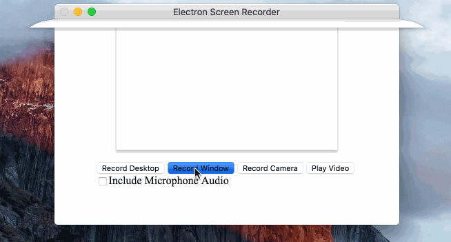

# Using electron framework Screen Recorder

This is an electron-based screen recorder application. It uses WebRTC and
recording.

You can choose a specific screen/window to record, and the record file is saved
as `webm`.



## Using

```sh
npm install -g electron-screen-recorder
electron-screen-recorder
```

